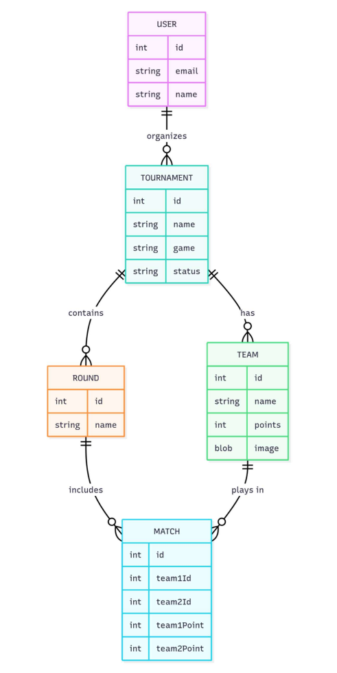

# CND
## Aux Claviers Citoyens

Jeunes citoyennes et citoyens, votre mission si vous l’acceptez est de mettre en œuvre les services
numériques nécessaires à la pratique du e-sport en environnement militaire.

Le e-sport (ou sport électronique) désigne la pratique compétitive du jeu vidéo organisée sous forme
de tournoi.

Pour les militaires, le e-sport permet de développer des compétences essentielles comme la capacité
de prise de décision rapide, la gestion du stress, le travail en équipe et la coordination ou encore le
leadership. Tout comme le sport traditionnel, le e-sport permet de renforcer la cohésion des équipes
en créant du lien social par une activité ludique, notamment pendant les temps de repos entre les
entrainements et les missions. Il contribue à forger un esprit de corps en stimulant la fierté
d’appartenance et la motivation.

Vous êtes des jeunes étudiants en BTS SIO ou CIEL. Vous vous destinez à une carrière dans le
numérique, domaine essentiel dans le monde d’aujourd’hui, véritable levier de transformation qui
influence notre façon de vivre et de travailler et contribue à la souveraineté nationale. Le
commissariat au numérique de défense viendra bientôt à votre rencontre pour vous soumettre un
projet pédagogique novateur.

Vous aurez à développer une application permettant de suivre l’évolution du score durant les
tournois. Cette application sera connectée à des objets connectés afin de proposer une expérience
fusionnant compétition virtuelle et effets réels. Pour réaliser cela, les compétences des étudiants BTS
SIO-SLAM et BTS CIEL s’associeront. Les BTS SIO-SIR contribueront à ce défi pour déployer les postes
des joueurs, les moyens réseaux et les serveurs hébergeant l’application développée. Des techniciens
du Commissariat au Numérique de Défense (CND) viendront à votre rencontre pour vous expliquer
les attends et vous aider à relever ce défi.

Au terme d’une première phase projet vous présenterez le résultat aux équipes du C§ND qui vous
attribueront un score. Les meilleurs lycées seront qualifiés pour un tournoi de e-sport qui se tiendra
le 1er avril prochain sur la Base aérienne école 721 de Rochefort, haut lieu de la formation des sousofficiers techniciens numériques de l’armée de l’air et de l’espace. Durant cette journée vous
observerez les moyens que vous avez développés concrètement mis en œuvre. Au terme de ce
tournoi qui rassemblera étudiants et jeunes militaires, le classement final sera établi et les meilleurs
seront récompensés.

Etes-vous prêts à relever le défi ?
Alors aux claviers citoyens.

## 1. Contexte :
Dans le cadre du projet Aux Claviers Citoyens, une application permettant de compter le score des
différentes parties est nécessaire. Cette application devra permettre de gérer et visualiser les
tournois et leurs participants.

## 2. Objectifs :
Cette application doit permettre :
- La gestion de l’authentification
- La gestion des utilisateurs
- La gestion du tournoi (notamment la possibilité de créer, modifier, afficher les résultats, …)
- La gestion des équipes qui participent à ces tournois
- La gestion des matchs

Pour cela, le contrat d’API suivant vous est fourni :

### A. Gestion de l’authentification

Fonction : OAuth2 Password Token
Description Littérale : Cette fonction permet d'obtenir un passeport numérique sécurisé (un jeton)
pour prouver votre identité auprès de l'API. C'est l'étape nécessaire avant d'accéder à toutes les
autres fonctions qui exigent d'être connecté.
Ce que la fonction a besoin de recevoir (Entrée) : Votre adresse e-mail (dans le champ username) et
votre mot de passe personnel.
Ce que la fonction renvoie (Sortie) : Un jeton d'accès (le passeport numérique) qui contient votre
identité et un code de validité (type Bearer), ainsi que sa durée de vie en secondes.

Fonction : User login
Description Littérale : C'est la fonction classique de connexion. Elle vérifie que votre e-mail et votre
mot de passe sont corrects pour vous laisser entrer dans le système.
Ce que la fonction a besoin de recevoir (Entrée) : Votre adresse e-mail et votre mot de passe
personnel.
Ce que la fonction renvoie (Sortie) : Un jeton d'accès (votre passeport numérique) avec son type et sa
durée de validité.

Fonction : Register a new user
Description Littérale : C'est la fonction d'inscription. Elle crée votre nouveau compte dans le système.
Ce que la fonction a besoin de recevoir (Entrée) : Votre adresse e-mail et le mot de passe que vous
souhaitez utiliser.
Ce que la fonction renvoie (Sortie) : Un jeton d'accès pour votre session nouvellement créée.

Fonction : Get the current authenticated user
Description Littérale : Permet de savoir qui vous êtes (votre profil) en tant qu'utilisateur actuellement
connecté.
Ce que la fonction a besoin de recevoir (Entrée) : Votre jeton d'accès (pour prouver que vous êtes
connecté).
Ce que la fonction renvoie (Sortie) : Vos informations publiques : votre identifiant unique, votre email et votre nom (s'il existe).

### B. Gestion des utilisateurs

Fonction : Get a user by id
Description Littérale : Récupère les informations d'un autre utilisateur en connaissant son numéro
d'identification unique.
Ce que la fonction a besoin de recevoir (Entrée) : Le numéro d'identification (ID) de l'utilisateur
recherché.
Ce que la fonction renvoie (Sortie) : Les informations publiques de l'utilisateur (ID, e-mail, nom).

Fonction : Update user details
Description Littérale : Permet de modifier vos informations personnelles, comme votre e-mail ou
votre nom d'affichage.
Ce que la fonction a besoin de recevoir (Entrée) : Le numéro d'identification (ID) de votre compte, et
les nouvelles informations que vous souhaitez modifier (votre nouvel e-mail ou nom).
Ce que la fonction renvoie (Sortie) : Vos informations publiques mises à jour (ID, e-mail, nom).

Fonction : Update user password
Description Littérale : Permet de changer votre mot de passe actuel.
Ce que la fonction a besoin de recevoir (Entrée) : Le numéro d'identification (ID) de votre compte et
votre nouveau mot de passe (qui doit avoir entre 8 et 48 caractères).
Ce que la fonction renvoie (Sortie) : Un message de succès confirmant que la mise à jour a été
effectuée.

### C. Gestion du tournoi

Fonction : List tournaments
Description Littérale : Donne la liste complète de tous les tournois disponibles dans le système.
Ce que la fonction a besoin de recevoir (Entrée) : Aucun.
Ce que la fonction renvoie (Sortie) : Une liste d'objets contenant pour chaque tournoi : son ID, son
nom, le jeu pratiqué et son état actuel.

Fonction : Create a tournament
Description Littérale : Permet de créer et d'organiser un nouveau tournoi.
Ce que la fonction a besoin de recevoir (Entrée) : Le nom du tournoi, le jeu concerné, et le nombre
d'équipes qui participeront (au moins 2).
Ce que la fonction renvoie (Sortie) : Les détails du tournoi qui vient d'être créé.

Fonction : Get a tournament
Description Littérale : Affiche les détails précis d'un tournoi en particulier.
Ce que la fonction a besoin de recevoir (Entrée) : Le numéro d'identification (ID) du tournoi.
Ce que la fonction renvoie (Sortie) : Les détails du tournoi (ID, nom, jeu, statut).

Fonction : Update a tournament
Description Littérale : Permet à l'organisateur de modifier les informations du tournoi (nom, jeu ou
statut).
Ce que la fonction a besoin de recevoir (Entrée) : Le numéro d'identification (ID) du tournoi, et les
informations à modifier (nom, jeu ou statut).
Ce que la fonction renvoie (Sortie) : Les détails du tournoi mis à jour.

Fonction : Delete a tournament
Description Littérale : Permet de supprimer définitivement un tournoi du système.
Ce que la fonction a besoin de recevoir (Entrée) : Le numéro d'identification (ID) du tournoi.
Ce que la fonction renvoie (Sortie) : Un message de succès confirmant la suppression.

### D. Gestion des équipes

Fonction : List teams for a tournament
Description Littérale : Donne la liste des équipes inscrites à un tournoi donné.
Ce que la fonction a besoin de recevoir (Entrée) : Le numéro d'identification (ID) du tournoi.
Ce que la fonction renvoie (Sortie) : Une liste d'objets avec les détails de chaque équipe (ID, nom et
points accumulés).

Fonction : Create a team in a tournament
Description Littérale : Permet d'inscrire une nouvelle équipe dans un tournoi.
Ce que la fonction a besoin de recevoir (Entrée) : Le numéro d'identification (ID) du tournoi, et le
nom de la nouvelle équipe.
Ce que la fonction renvoie (Sortie) : Les détails de l'équipe qui vient d'être créée.

Fonction : Get a team in a tournament
Description Littérale : Affiche les détails précis d'une équipe dans un tournoi.
Ce que la fonction a besoin de recevoir (Entrée) : Le numéro d'identification (ID) du tournoi et l'ID de
l'équipe.
Ce que la fonction renvoie (Sortie) : Les détails de l'équipe (ID, nom, points).

Fonction : Update a team in a tournament
Description Littérale : Permet de changer le nom d'une équipe dans un tournoi.
Ce que la fonction a besoin de recevoir (Entrée) : Le numéro d'identification (ID) du tournoi, l'ID de
l'équipe, et le nouveau nom (optionnel).
Ce que la fonction renvoie (Sortie) : Les détails de l'équipe mise à jour.

Fonction : Delete a team in a tournament
Description Littérale : Permet de retirer une équipe d'un tournoi.
Ce que la fonction a besoin de recevoir (Entrée) : Le numéro d'identification (ID) du tournoi et l'ID de
l'équipe.
Ce que la fonction renvoie (Sortie) : Un message de succès confirmant la suppression.

### E&F. GESTION DES MATCHS ET ROUND

Fonction : List rounds for a tournament
Description Littérale : Donne la liste des tours de jeu (rounds) qui composent un tournoi.
Ce que la fonction a besoin de recevoir (Entrée) : Le numéro d'identification (ID) du tournoi.
Ce que la fonction renvoie (Sortie) : Une liste d'objets décrivant chaque round (ID, nom et liste des
IDs des matchs qui le composent).

Fonction : Get a round in a tournament
Description Littérale : Affiche les détails précis d'un tour de jeu (round) dans un tournoi.
Ce que la fonction a besoin de recevoir (Entrée) : Le numéro d'identification (ID) du tournoi et l'ID du
round.
Ce que la fonction renvoie (Sortie) : Les détails du round.

Fonction : List matches for a tournament
Description Littérale : Donne la liste de tous les matchs prévus dans un tournoi.
Ce que la fonction a besoin de recevoir (Entrée) : Le numéro d'identification (ID) du tournoi.
Ce que la fonction renvoie (Sortie) : Une liste d'objets décrivant chaque match (ID, IDs des deux
équipes qui s'affrontent, et leurs scores respectifs).

Fonction : Get a match in a tournament
Description Littérale : Affiche les détails précis d'un match spécifique.
Ce que la fonction a besoin de recevoir (Entrée) : Le numéro d'identification (ID) du tournoi et l'ID du
match.
Ce que la fonction renvoie (Sortie) : Les détails du match.

Fonction : Update match points
Description Littérale : Permet d'enregistrer le score pour une équipe dans un match en cours.
Ce que la fonction a besoin de recevoir (Entrée) : Le numéro d'identification (ID) du tournoi, l'ID du
match, l'ID de l'équipe dont le score change, et le nouveau score de cette équipe.
Ce que la fonction renvoie (Sortie) : Un message de succès confirmant la mise à jour.

### G. Bonus

Une fois cette partie développée et fonctionnelle, s’il vous reste du temps, un bonus vous est
proposé.

Il conviendra pour cette partie de réaliser un « front-end » de cette application. Il s’agit de
l’apparence de l’application et l’interface avec l’utilisateur. Vous pourrez vous inspirer des captures
d’écran provenant de la maquette réalisée et des quelques pages de front qui vous seront données
pendant votre projet...ou inventer une tout autre interface. A vous de jouer.

## 3. Schéma

## 4. Ressources fournies

- Le présent document.
- Le contrat d’API
- Des images correspondantes à la maquette du front (en annexe)
- Les premières pages du front (en cours de projet)
